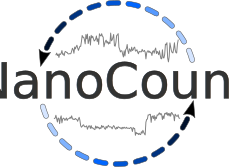
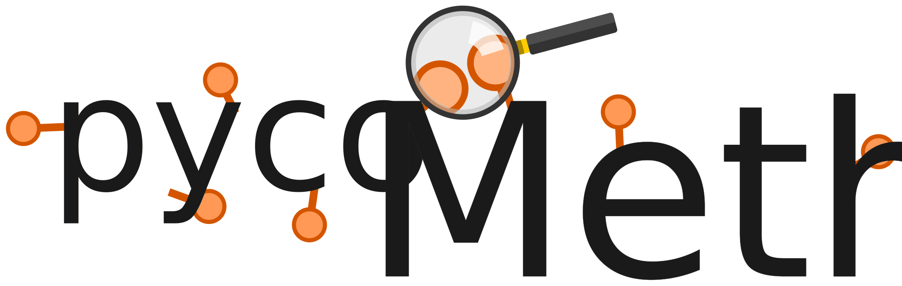

### Hi there 👋 I am Adrien Leger

   

I am a **computational biologist** and **open source software developer** working as a senior postdoc at the EMBL-EBI in the [Birney research group](https://www.ebi.ac.uk/research/birney) 

**I ❤️ Python and Dataviz**

### Projects

 

 

 

 

